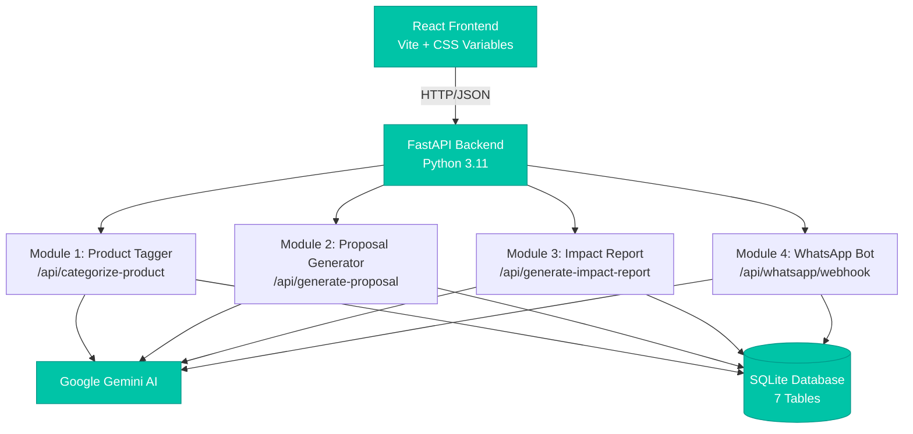
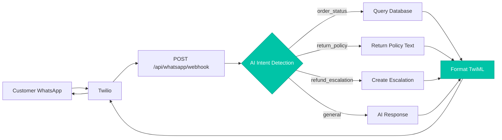

<div align="center">

# 🌱 Rayeva AI Dashboard

### *Intelligent Automation for Sustainable E-Commerce*

[](https://fastapi.tiangolo.com/)
[](https://python.org)
[](https://react.dev)
[](https://vitejs.dev)
[](https://ai.google.dev)

**AI-powered automation platform built for [Rayeva World Pvt Ltd](https://rayeva.com) 🌍**

[Features](#-features) • [Quick Start](#-quick-start) • [API Docs](#-api-reference) • [Tech Stack](#-tech-stack) • [Demo](#-demo)

</div>

---

## 📋 Table of Contents

- [About](#-about)
- [Features](#-features)
- [Tech Stack](#-tech-stack)
- [Architecture](#-architecture)
- [Quick Start](#-quick-start)
- [Module Details](#-module-details)
- [API Reference](#-api-reference)
- [Database Schema](#-database-schema)
- [Environment Setup](#-environment-setup)
- [Project Structure](#-project-structure)
- [Demo](#-demo)

---

## 🎯 About

**Rayeva** is revolutionizing sustainable e-commerce with eco-friendly products. This dashboard automates their most time-intensive operations using **Google Gemini AI**, reducing manual work by 80% while improving accuracy and customer experience.

> 💡 **Built as an internship project** to demonstrate real-world AI integration in sustainable business operations.

---

## ✨ Features

<table>
<tr>
<td width="50%">

### 🏷️ **Smart Product Tagger**
Automatically categorize products and generate SEO-optimized tags with sustainability filters.

**Key Benefits:**
- ⚡ Instant categorization
- 🎯 95%+ accuracy
- 🔍 SEO tag generation
- ♻️ Sustainability scoring

</td>
<td width="50%">

### 💼 **B2B Proposal Generator**
Create customized bulk purchase proposals that maximize budget utilization.

**Key Benefits:**
- 💰 Budget optimization (90-100%)
- 📊 Impact calculations
- 🎨 Professional formatting
- 🌱 ESG alignment

</td>
</tr>
<tr>
<td width="50%">

### 🌍 **Impact Report Generator**
Calculate environmental impact with precision — plastic saved, carbon avoided, and local sourcing metrics.

**Key Benefits:**
- 📈 Real-time calculations
- 🌊 Plastic waste tracking
- 🌿 Carbon footprint analysis
- 📝 Human-readable reports

</td>
<td width="50%">

### 💬 **WhatsApp Support Bot**
Intelligent customer support via WhatsApp with automatic intent detection and routing.

**Key Benefits:**
- 🤖 24/7 availability
- 🎯 Intent classification
- 📦 Order tracking
- 🚨 Smart escalation

</td>
</tr>
</table>

---

## 🛠️ Tech Stack

### **Backend**


### **Frontend**


### **AI & Integration**


---

## 🏗️ Architecture




> **System Flow:** React frontend communicates with FastAPI backend via REST API. Each module leverages Google Gemini AI for intelligent processing, with all data persisted in SQLite.

---

## 🚀 Quick Start

### **Prerequisites**
- Python 3.11+
- Node.js 18+
- Google Gemini API Key ([Get one free](https://aistudio.google.com/app/apikey))

### **Backend Setup**

```bash
# 1️⃣ Clone the repository
git clone https://github.com/YOUR_USERNAME/rayeva-ai-modules.git
cd rayeva-ai-modules

# 2️⃣ Create and activate virtual environment
python -m venv venv

# Windows
venv\Scripts\activate

# Mac/Linux
source venv/bin/activate

# 3️⃣ Install dependencies
pip install -r requirements.txt

# 4️⃣ Configure environment variables
cp .env.example .env
# Edit .env and add your GEMINI_API_KEY

# 5️⃣ Seed database with test data
python seed_data.py

# 6️⃣ Start the server
uvicorn main:app --reload
```

✅ **Backend running at:** `http://127.0.0.1:8000`  
📚 **API Documentation:** `http://127.0.0.1:8000/docs`

### **Frontend Setup**

```bash
# 1️⃣ Navigate to frontend directory
cd frontend

# 2️⃣ Install dependencies
npm install

# 3️⃣ Start development server
npm run dev
```

✅ **Dashboard running at:** `http://localhost:5173`

> 🎉 **You're all set!** Open the dashboard and start exploring the modules.

---

## 🤖 Module Details


<details>
<summary><b>🏷️ Module 1 — Smart Product Tagger</b></summary>

<br/>

**🎯 Purpose:** Automatically categorize products and generate SEO-optimized tags with sustainability scoring.

**📥 Input:** Product name + description

**📤 Output:** Category, sub-category, SEO tags, sustainability filters, confidence score

#### Example Request
```json
{
  "product_name": "BambooFresh Toothbrush",
  "product_description": "Biodegradable bamboo, plastic-free packaging"
}
```

#### Example Response
```json
{
  "category": "Personal Care",
  "sub_category": "Oral Hygiene",
  "seo_tags": ["bamboo toothbrush", "plastic-free", "eco toothbrush"],
  "sustainability_filters": ["plastic-free", "biodegradable"],
  "confidence_score": 0.95
}
```

#### 🧠 AI Strategy
- **Role-based prompting** with predefined category taxonomy
- **Strict JSON output** enforcement
- **Temperature: 0.3** for consistency
- **Validation:** Confidence scoring for quality assurance

</details>

<details>
<summary><b>💼 Module 2 — B2B Proposal Generator</b></summary>

<br/>

**🎯 Purpose:** Generate customized bulk purchase proposals that maximize budget utilization while meeting client preferences.

**📥 Input:** Client details, budget, employee count, sustainability preferences

**📤 Output:** Product recommendations, pricing breakdown, impact summary, ESG positioning

#### Example Request
```json
{
  "client_name": "GreenTech Pvt Ltd",
  "industry": "Technology",
  "budget": 50000,
  "num_employees": 50,
  "preferences": ["plastic-free", "recycled"]
}
```

#### Example Response
```json
{
  "recommended_products": [
    {
      "product_name": "Bamboo Desk Organizer",
      "category": "Office & Stationery",
      "quantity": 50,
      "unit_price": 299,
      "total_price": 14950,
      "sustainability_features": ["plastic-free", "biodegradable"]
    }
  ],
  "total_cost": 49850,
  "budget_utilization_percent": 99.7,
  "impact_summary": "Eliminates approximately 600 single-use plastic items",
  "impact_positioning": "Perfect for ESG goals and CSR reporting"
}
```

#### 🧠 AI Strategy
- **Role:** B2B sales consultant persona
- **Budget constraint:** Strict adherence with 90-100% utilization target
- **Temperature: 0.5** for balanced creativity
- **Output:** Professional proposal format with impact metrics

</details>

<details>
<summary><b>🌍 Module 3 — Impact Report Generator</b></summary>

<br/>

**🎯 Purpose:** Calculate precise environmental impact metrics and generate human-readable sustainability reports.

**📥 Input:** Order ID + product list with sustainability attributes

**📤 Output:** Plastic saved, carbon avoided, local sourcing %, impact statement

#### Two-Step Processing

**Step 1: Python Calculations** *(No AI guessing)*
```python
plastic_saved_grams = weight × quantity × 0.8   # plastic-free items
carbon_avoided_kg   = weight × quantity × 0.002 # local/organic items
local_sourcing_%    = local_items / total × 100
```

**Step 2: AI Communication** *(Gemini writes engaging statement)*
```
"Your order saved 144g of plastic — like removing
 96 straws from the ocean! 🌊"
```

#### Example Response
```json
{
  "plastic_saved_grams": 144.0,
  "carbon_avoided_kg": 0.36,
  "local_sourcing_percent": 50.0,
  "impact_statement": "Amazing! Your order saved 144g of plastic — equivalent to removing 96 plastic straws from the ocean! 🌊 You also avoided 0.36kg of carbon emissions. Keep making a difference! 🌱"
}
```

#### 🧠 AI Strategy
- **Hybrid approach:** Python for math, AI for communication
- **Temperature: 0.7** for warm, engaging tone
- **Max tokens: 500** for concise statements
- **Validation:** Math verified before AI processing

</details>

<details>
<summary><b>💬 Module 4 — WhatsApp Support Bot</b></summary>

<br/>

**🎯 Purpose:** Provide 24/7 intelligent customer support via WhatsApp with automatic intent detection and routing.

**📥 Input:** Twilio webhook POST (customer WhatsApp message)

**📤 Output:** TwiML XML response sent back to customer

#### System Flow



#### Intent Categories
- **`order_status`** → Query database for order tracking
- **`return_policy`** → Return hardcoded policy text
- **`refund_escalation`** → Log to database, alert team
- **`general`** → AI-generated response

#### Test Commands (with seed data)
```
"Where is my order ORD-001?" → Order found, status returned
"What is your return policy?" → Policy text returned
"I want a refund now!"        → Escalation created, team alerted
```

#### 🧠 AI Strategy
- **Strict classification:** Single-word intent output
- **Temperature: 0.3** for consistent routing
- **Fallback:** Always defaults to "general" on failure
- **Logging:** All conversations stored for analysis

</details>

---

## 📡 API Reference

### **Module 1: Product Tagger**
| Method | Endpoint | Description |
|--------|----------|-------------|
| `POST` | `/api/categorize-product` | Tag a product with AI |
| `GET` | `/api/products` | List all tagged products |

### **Module 2: Proposal Generator**
| Method | Endpoint | Description |
|--------|----------|-------------|
| `POST` | `/api/generate-proposal` | Generate B2B proposal |
| `GET` | `/api/proposals` | List all proposals |

### **Module 3: Impact Report**
| Method | Endpoint | Description |
|--------|----------|-------------|
| `POST` | `/api/generate-impact-report` | Calculate order impact |
| `GET` | `/api/impact-reports` | List all impact reports |

### **Module 4: WhatsApp Bot**
| Method | Endpoint | Description |
|--------|----------|-------------|
| `POST` | `/api/whatsapp/webhook` | Twilio webhook handler |
| `GET` | `/api/whatsapp/logs` | View conversations |
| `GET` | `/api/escalations` | View escalations |

> 📚 **Interactive API Docs:** Visit `http://127.0.0.1:8000/docs` for full Swagger documentation with live testing.

---

## 🗄️ Database Schema

**7 SQLAlchemy Tables:**

| Table | Purpose | Key Fields |
|-------|---------|------------|
| `product_tags` | Module 1 outputs | category, sub_category, seo_tags, sustainability_filters |
| `b2b_proposals` | Module 2 outputs | client_name, recommended_products, total_cost, budget_utilization |
| `impact_reports` | Module 3 outputs | plastic_saved_grams, carbon_avoided_kg, impact_statement |
| `orders` | Seed data for testing | order_id, customer_name, products, status |
| `whatsapp_logs` | Module 4 conversations | message, intent, response, timestamp |
| `escalation_logs` | Flagged customer issues | customer_message, status (pending/resolved) |
| `ai_logs` | AI call tracking | module, prompt, response, success, timestamp |

> 💾 **Database:** SQLite for simplicity. Production-ready with easy migration to PostgreSQL/MySQL.

---

## ⚙️ Environment Setup

### **Required Variables**

```bash
# .env file

# 🔑 Google Gemini API Key (Required)
# Get your free key: https://aistudio.google.com/app/apikey
GEMINI_API_KEY=your_api_key_here

# 📱 Twilio Configuration (Optional - only for live WhatsApp testing)
TWILIO_ACCOUNT_SID=your_account_sid
TWILIO_AUTH_TOKEN=your_auth_token
TWILIO_WHATSAPP_NUMBER=whatsapp:+14155238886

# 🌐 Frontend Configuration
VITE_API_BASE_URL=http://127.0.0.1:8000
```

> ⚠️ **Important:** Never commit your `.env` file. Use `.env.example` as a template.

---

## 📁 Project Structure

```
rayeva-ai-dashboard/
│
├── 📂 modules/                      # AI Module Implementations
│   ├── module1_tagger.py           # 🏷️ Product categorization & tagging
│   ├── module2_proposal.py         # 💼 B2B proposal generation
│   ├── module3_impact.py           # 🌍 Environmental impact calculations
│   └── module4_whatsapp.py         # 💬 WhatsApp bot with intent routing
│
├── 📂 frontend/                     # React Dashboard
│   ├── 📂 src/
│   │   ├── 📂 pages/
│   │   │   ├── Home.jsx            # Landing page
│   │   │   ├── ProductTagger.jsx   # Module 1 interface
│   │   │   ├── ProposalGenerator.jsx # Module 2 interface
│   │   │   ├── ImpactReport.jsx    # Module 3 interface
│   │   │   └── WhatsAppBot.jsx     # Module 4 interface
│   │   │
│   │   ├── 📂 components/
│   │   │   ├── Navbar.jsx          # Navigation with teal theme
│   │   │   └── JsonDisplay.jsx     # Formatted JSON viewer
│   │   │
│   │   ├── 📂 api/
│   │   │   └── client.js           # Axios API client
│   │   │
│   │   ├── App.jsx                 # Main app component
│   │   └── index.css               # Global styles (CSS Variables)
│   │
│   ├── index.html
│   ├── package.json
│   └── vite.config.js
│
├── 📄 main.py                       # FastAPI app with all routes + CORS
├── 📄 models.py                     # SQLAlchemy table definitions (7 tables)
├── 📄 database.py                   # SQLite engine + session management
├── 📄 ai_client.py                  # Google Gemini API client wrapper
├── 📄 seed_data.py                  # Test data generator (5 sample orders)
│
├── 📄 requirements.txt              # Python dependencies
├── 📄 .env.example                  # Environment template
├── 📄 .gitignore
└── 📄 README.md                     # You are here! 👋
```

---

## 🎬 Demo

### **Test Data Available**

The system comes pre-seeded with 5 sample orders for testing the WhatsApp bot:

| Order ID | Customer | Product | Status | Test Query |
|----------|----------|---------|--------|------------|
| `ORD-001` | Priya Sharma | Bamboo Toothbrush × 2 | ✅ Delivered | "Where is my order ORD-001?" |
| `ORD-002` | Rahul Mehta | Reusable Water Bottle × 1 | 📦 Shipped | "Track order ORD-002" |
| `ORD-003` | Ananya Singh | Organic Cotton Tote × 3 | ⏳ Processing | "Status of ORD-003?" |
| `ORD-004` | Vikram Patel | Compostable Plates × 10 | ✅ Delivered | "Where is ORD-004?" |
| `ORD-005` | Sneha Joshi | Beeswax Food Wraps × 5 | 📦 Shipped | "Check ORD-005 status" |

### **Screenshots**

> 📸 *Dashboard screenshots coming soon! The interface features a modern teal theme with intuitive navigation and real-time AI responses.*

### **Live Demo**

Want to see it in action? Follow the [Quick Start](#-quick-start) guide to run it locally in under 5 minutes!

---

## 🤝 Contributing

This project was built as an internship assignment, but contributions are welcome!

**Areas for improvement:**
- 🎨 Enhanced UI/UX designs
- 🧪 Unit and integration tests
- 📊 Analytics dashboard
- 🔐 Authentication system
- 🌐 Multi-language support
- 📱 Mobile app integration

---

## 📝 License

This project is part of an internship assignment for **Rayeva World Pvt Ltd**.

---

## 👨‍💻 Author

**Rushikesh Randive**  
*Full Stack / AI Intern*  
Rayeva World Pvt Ltd • 2026

---

<div align="center">

### 🌱 Built with passion for sustainable commerce

**[⬆ Back to Top](#-rayeva-ai-dashboard)**

---

*Automating sustainability, one AI module at a time* 🚀

</div>
